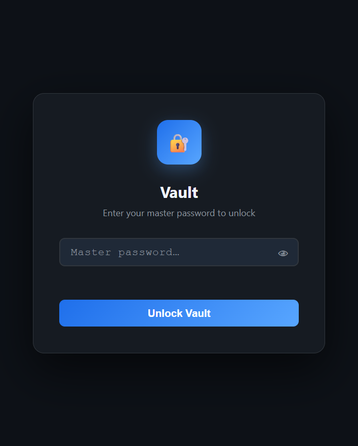

# Vault - Password Wallet

A **single-file**, local password verification wallet built entirely with Python's standard library. It generates strong passwords, records where they are used, and verifies a known password without storing a recoverable copy. This is intentionally a **verifier-only** wallet: it can check whether a password matches a saved entry, but it does not store or recover plaintext passwords.


---

## Features

- **Zero dependencies** — pure Python stdlib only (`http.server`, `hashlib`, `hmac`, `secrets`)
- **Master password protection** — PBKDF2-HMAC-SHA256 with 200,000 iterations
- **One-way password storage** - saved passwords are represented by salted PBKDF2 verifiers and are never recoverable from `wallet.json`
- **Password generator** - configurable length (8-64), uppercase, lowercase, digits, symbols
- **Password strength meter** — live visual feedback as you type
- **Categories** — Web, Finance, Email, Social, Work, Other
- **Search & filter** — instant search across titles, usernames, and URLs
- **Copy to clipboard** — one-click copy for usernames and URLs; saved passwords are never exposed after the session
- **Verify without revealing** - test a password against an entry's verifier without recovering or displaying the saved password
- **Dark vault UI** - modern dark-mode interface with no external CSS or JS frameworks
- **Auto-opens browser** — launches `http://localhost:5743` automatically on start
- **Single file** - everything (HTML, CSS, JS, Python server, and verification logic) lives in `password_wallet.py`

---

## Quick Start

```bash
# Run - no installation needed
python password_wallet.py
```

Then open **http://localhost:5743** in your browser (it opens automatically).

> **Requirements:** Python 3.7 or higher. That's it. The command above is the complete launch procedure.

Python does not require a compilation step for this application. The syntax-check command below is the build verification; the run command launches the working program directly.

## Verify the Build

Run the complete dependency-free verification from the repository root:

```bash
python -m unittest discover -s tests -v
python -m py_compile password_wallet.py
```

The tests cover salted password verification, malformed verifier rejection, master-password verification, password generation rules, JSON storage, legacy-file detection, malformed requests, and the HTTP API lifecycle. The live demo also covers verifier-only password checking. See [`STDLIB.md`](STDLIB.md) for the module-by-module dependency proof.

For a plain-language overview of the app and its data flow, see [`PROJECT_EXPLAINED.md`](PROJECT_EXPLAINED.md).

---

## 🔒 Security Model

| Layer | Implementation |
|---|---|
| Key derivation | PBKDF2-HMAC-SHA256, 200,000 iterations, 16-byte random salt per entry |
| Password records | Salted PBKDF2-HMAC-SHA256 verifiers; plaintext passwords are not persisted |
| Comparison | Constant-time HMAC comparison prevents timing leaks during verification |
| Master password | Stored only as a PBKDF2 verifier hash, never in plaintext |
| In-memory only | Entered passwords exist only during the current form/session and are never written to disk |

> **Security note:** This project deliberately does not implement encryption. It stores one-way password verifiers using PBKDF2-HMAC-SHA256. That means saved passwords cannot be recovered by the app. Use a professionally reviewed password manager for production secrets.

## Dependency Proof

The repository includes an intentionally empty `requirements.txt`; there is no package installation step. Runtime code, tests, and the local web server use only Python's standard library. The complete inventory and proof commands are in [`STDLIB.md`](STDLIB.md).

## Hackathon Track

Vault fits **Track E - Security & Crypto Utilities** as a local password-generation and password-verification tool. It deliberately does not implement custom encryption. Its security boundary is simple and auditable: PBKDF2-HMAC-SHA256 creates one-way verifiers, and the original passwords are discarded after verification.

## Demo Script

[`DEMO.md`](DEMO.md) contains a timed five-minute demonstration script covering the launch, vault creation, password generation, CRUD workflow, verifier-only checking, and test evidence.

> This project is intentionally not a recoverable password database. The app stores one-way verifiers and validates a guessed password against them; it does not expose or reconstruct saved passwords.

---

## 📁 Project Structure

```
password-wallet-main/
├── password_wallet.py   # The entire application (server + UI + verification)
├── tests/                # Dependency-free unittest suite
├── STDLIB.md             # Standard-library inventory and proof
├── DEMO.md               # Five-minute demo recording script
├── PROJECT_EXPLAINED.md  # Plain-language project explanation
└── wallet.json          # Auto-created locally; never commit it
```

**`wallet.json`** stores only:
- A PBKDF2 verifier of your master password
- Entry metadata and salted PBKDF2 password verifiers — no plaintext passwords

---

## 🖥️ Usage

### First Run
1. Run `python password_wallet.py`
2. Set a **master password** (minimum 6 characters — choose something strong and memorable)
3. Your vault is created. Start adding entries.

### Adding an Entry
1. Click **+ Add** in the sidebar
2. Fill in the title, username, password, URL, and notes
3. Use the built-in **Password Generator** to create a strong password
4. Click **Save Entry**. The password is verified and then discarded; it cannot be recovered later.

### Verifying an Entry

Select an entry and click **Verify** to test a password you already know. The server returns only whether it matches; it never returns the verifier or the saved password.

### Locking the Vault
Click the **🔒 Lock** button in the top-right corner. The master password and current entry metadata are cleared from memory.

### Generating a Password
Inside the Add/Edit modal, the **⚡ Generate** button creates a random password based on your chosen options. Click **↑ Use this password** to apply it to the entry.

---

## Screenshot



---

## 🛠️ Configuration

| Setting | Default | Description |
|---|---|---|
| Host | `127.0.0.1` | Localhost only (not exposed to network) |
| Port | `5743` | Web server port |
| Data file | `wallet.json` | Password-verifier vault location |

To change the port, edit the `HOST, PORT` line near the bottom of `password_wallet.py`:

```python
HOST, PORT = "127.0.0.1", 5743
```

---

## ⚠️ Backup Your Vault

`wallet.json` contains metadata and one-way password verifiers. **Back it up regularly.** If you lose it, the saved passwords cannot be recovered. Forgetting the master password also prevents access.

Wallet files from the older encrypted format are rejected with a migration message. Start with a fresh `wallet.json` for this version.

## Threat Model

Vault protects against accidental plaintext storage and against someone reading `wallet.json` and immediately recovering saved passwords. It does not protect against malware, keyloggers, browser extensions, screenshots, a compromised computer, or someone watching the live session. This is an educational local tool, not a replacement for a professionally reviewed password manager.

```bash
# Simple backup example
cp wallet.json wallet_backup_$(date +%Y%m%d).json
```

---

## 📄 License

Apache License 2.0 — free to use, modify, and distribute under the terms in [`LICENSE`](LICENSE).

---

## 👤 Authors

**Dhara103**
📧 [dharamittal103@gmail.com](mailto:dharamittal103@gmail.com)

**tanishk-a**
📧 [tanishka.minghlani01@gamil.com](mailto:tanishka.minghlani01@gamil.com)

---

## 🤝 Contributing

Pull requests are welcome. For major changes, please open an issue first to discuss what you'd like to change.

1. Fork the repository
2. Create your feature branch (`git checkout -b feature/my-feature`)
3. Commit your changes (`git commit -m 'Add my feature'`)
4. Push to the branch (`git push origin feature/my-feature`)
5. Open a Pull Request

---

*Built with Python's standard library and zero dependencies.*
